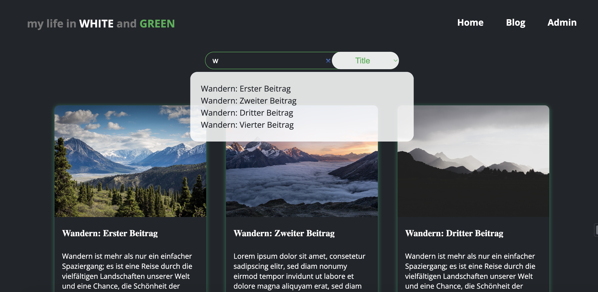

# Blog - My Life In White And Green

As part of a Full-Stack Developer Bootcamp, I embarked on this project, which quickly evolved into a personal passion. It exceeded the original assignment, driven by my initiative to explore new realms in web development.

Technical Foundation: This project is underpinned by the MERN stack - MongoDB, ExpressJS, ReactJS, and NodeJS. Currently, it functions without MongoDB, implying no database integration yet.

Developmental Goals: My primary focus was to deepen my skills in backend development, with a special emphasis on mastering Express.js and file upload management using Multer. Additionally, the project was an opportunity to reinforce the synergy between backend and frontend operations.

As it stands, "My Life In White And Green" blog is in its nascent stage, containing only test data. I have ambitious plans to fill it with real, engaging content.

Please Note:
The blog is presently non-responsive and tailored for desktop usage.
It's not live yet. To access the project, you need to clone it from -> [GitHub Repo](https://github.com/wilhelm-lenz/blog-my-life-in-white-and-green).

## Table of Contents

- [Overview](#overview)
  - [Screenshot](#screenshot)
  - [Links](#links)
- [My process](#my-process)
  - [Built with](#built-with)
  - [What I learned](#what-i-learned)
  - [Continued development](#continued-development)
  - [Useful resources](#useful-resources)
- [Author](#author)

## Overview

### How does the Blog work?

- Initially, visitors are greeted with a homepage featuring a hero section and a navigational path to the blog articles.
- The navigation menu facilitates toggling between the homepage, blog page, and an admin page.
- Blog posts are displayed in a card format, with each card showcasing the title, a brief summary, and the publication date. Hovering over a card reveals a trash can icon for deletion. Each card leads to the detailed blog post.
- Detail pages present the blog image, title, author, publication date, content, and a sidebar featuring recent posts.
- The admin page empowers the creation of new posts, incorporating author details, title, content, categories, SEO keywords, and the option to upload a title image.

### Screenshot

#### Desktop:

Home Page

Blog Page

Blog Page with autocomplete Searchbar

Blog Detail Page

Admin Page

### Links

- Solution Backend URL: [backend](https://github.com/wilhelm-lenz/blog-my-life-in-white-and-green/tree/main/backend)
- Solution Frontend URL: [frontend](https://github.com/wilhelm-lenz/blog-my-life-in-white-and-green/tree/main/frontend)

## My Process

### Built With

- Semantic HTML5 markup
- SCSS custom properties
- JavaScript
- React.js
- Node.js
- Express.js
- Vite.js (Build Tool)
- VS Code
- Git

### What I Learned

#### Backend Development:

In the backend, I delved into various HTTP methods and routing, targeting API endpoints. Skills in reading, writing files, managing uploads with Multer, and manipulating JSON data for API usage were cultivated. This comprehensive experience significantly elevated my backend capabilities.

#### Frontend Development:

The frontend phase was an enlightening journey, learning to query backend endpoints efficiently and maintain a seamless data flow between frontend and backend. I honed skills in data display, modification, and learned to proficiently handle file uploads, key for dynamic web applications.

### Continued Development

The forthcoming phase involves substantial enhancements:

- Responsive Design: Transitioning to a responsive design is imminent, essential for a broad, device-diverse audience.
- Advanced Image Management: Automating image management to coincide with blog post deletions will streamline content handling.
- Administrative Capabilities: Enhancing admin controls for post edits and deletion will fortify content integrity and security.
- Admin Dashboard Creation: Developing a centralized admin dashboard for blog management is a priority.
- Blog Expansion: Infusing the blog with real content and improving its design and functionality is on the horizon.
- MongoDB Integration: Incorporating MongoDB will elevate the blog’s data handling prowess.

### Useful Resources

For the "My Life In White And Green" blog, several resources have been instrumental in guiding the design and development process. These resources, chosen for their relevance and utility, have significantly contributed to the project's success:

- Open Color [@open color](https://yeun.github.io/open-color/) : This open-source color scheme, optimized for UI design, was a valuable aid for designing the user interface. Its range of harmonious colors enhanced the aesthetic appeal and user experience of the Todolist.
- NodeJS Documentation [@nodeJS](https://nodejs.org/docs/latest/api/) : NodeJS's comprehensive documentation has been an essential resource for backend development. It provides detailed information on NodeJS functionalities, helping to streamline the server-side development process and ensure efficient implementation of backend logic.
- ExpressJS Documentation [@expressJS](https://expressjs.com/) : ExpressJS's documentation has been pivotal in understanding and implementing web server frameworks. It offers insights into various aspects of ExpressJS, including routing, middleware, request handling, and more, which are crucial for building robust and scalable server-side applications.
- Vite Guide [@vite](https://vitejs.dev/guide/) : The Vite guide has been an excellent resource for understanding and implementing this modern frontend build tool. It provides comprehensive guidance on leveraging Vite for faster and more efficient development, particularly in enhancing the frontend build and development process.
- Multer - [@multer](https://github.com/expressjs/multer) : Multer has been a key resource for managing file uploads in the application. It simplifies the process of handling multipart/form-data, which is primarily used for uploading files, making it an invaluable tool for implementing the blog's file upload features.

Each of these resources has played a crucial role in different aspects of the project, from UI design to server-side development and file management. They have provided the necessary guidance and tools to build a functional, aesthetically pleasing, and user-centric blog platform.

## Autor

- Wilhelm Lenz - [@wilhelm-lenz](https://github.com/wilhelm-lenz)
