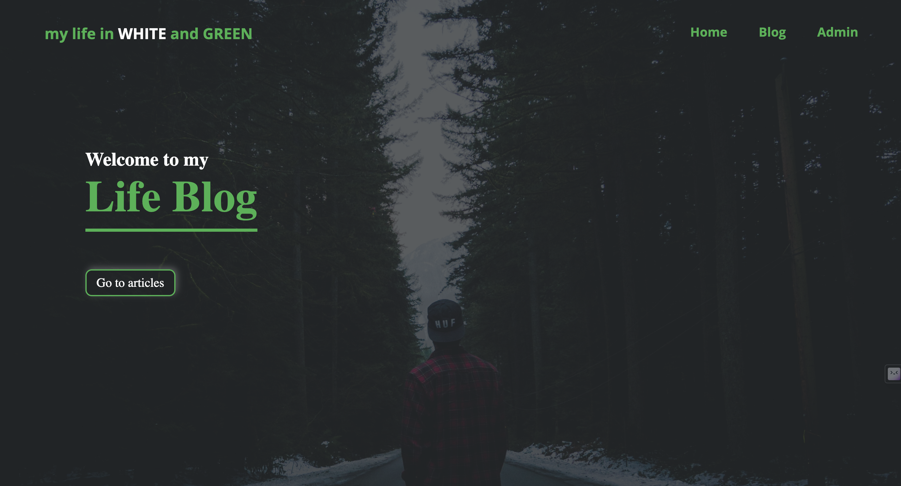
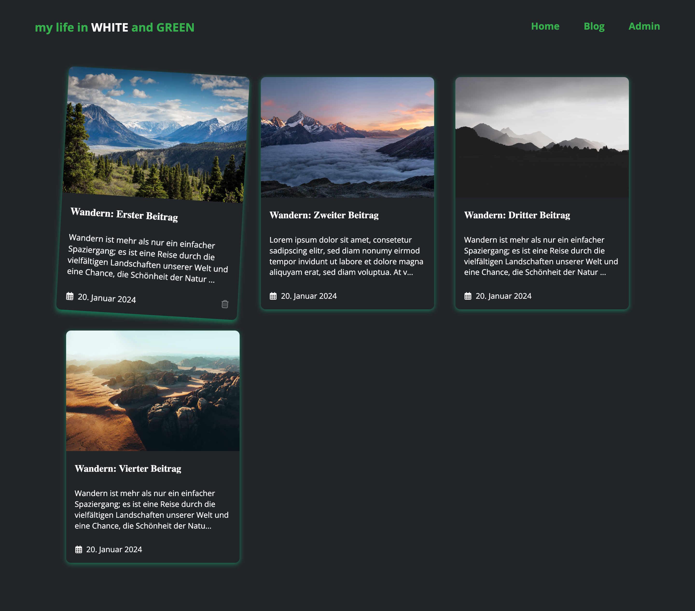
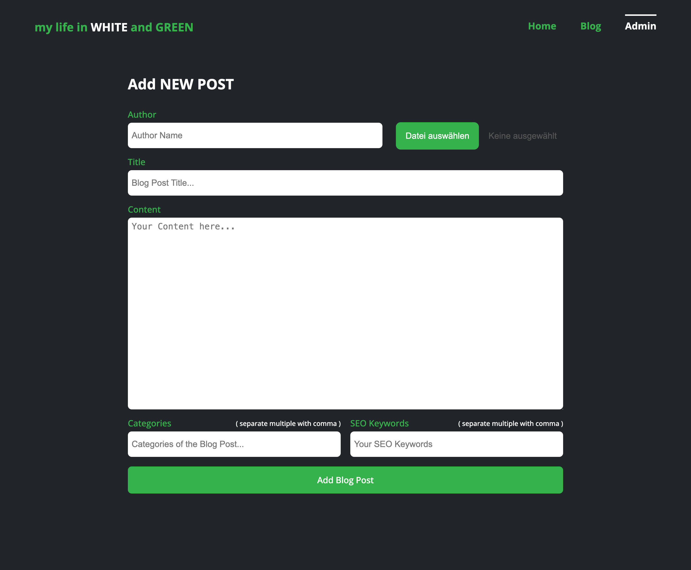

# Blog - My Life In White And Green

This project was developed as part of a Full-Stack Developer Bootcamp and was expanded by my own initiatives beyond the original assignment.

The project is based on the MERN stack (MongoDB, ExpressJS, ReactJS, NodeJS) - currently, however, without MongoDB (i.e., without database integration).

The aim of the project was to deepen my understanding of backend development, particularly working with Express.js and uploading files to the server using the npm package Multer. Additionally, it focused on enhancing the connection between backend and frontend.

This blog has become a passion project of mine, and I plan to populate it with real data later on. Currently, it only contains test data, and there is still much to be done.

Note!!!
Currently, the blog is not responsive and is optimized for desktop only.
The project is not yet live and needs to be cloned to be viewed. Clone here -> [GitHub Repo](https://github.com/wilhelm-lenz/blog-my-life-in-white-and-green).

## Table of Contents

- [Overview](#overview)
  - [Screenshot](#screenshot)
  - [Links](#links)
- [My process](#my-process)
  - [Built with](#built-with)
  - [What I learned](#what-i-learned)
  - [Continued development](#continued-development)
  - [Useful resources](#useful-resources)
- [Author](#author)

## Overview

### How does the Blog work?

- Visitors first see a homepage with a hero section and a button leading to the blog articles.
- The navigation menu allows choosing between the homepage, the blog page, and an admin page.
- The blog page displays all posts in card form. Each card includes the title, a brief description, and the publication date. Posts can be deleted by hovering over the card and clicking on the trash can icon. The cards themselves lead to the detailed page of each blog post.
- The detail page of a blog post shows the image, title, author, publication date, content, and a sidebar with recently created posts.
- On the admin page, a new blog post can be created. This includes setting the author, title, content, categories, SEO keywords, and uploading a title image. Clicking "Add Blog Post" publishes the post on the blog page.

### Screenshot

#### Desktop:

Home Page

Blog Page

Blog Detail Page

Admin Page

### Links

- Solution URL: [GitHub Repo](https://github.com/wilhelm-lenz/blog-my-life-in-white-and-green)
- Solution URL: [backend](https://github.com/wilhelm-lenz/blog-my-life-in-white-and-green/tree/main/backend)
- Solution URL: [frontend](https://github.com/wilhelm-lenz/blog-my-life-in-white-and-green/tree/main/frontend)

## My Process

### Built With

- Semantic HTML5 markup
- SCSS custom properties
- JavaScript
- React.js
- Node.js
- Express.js
- Vite.js (Build Tool)
- VS Code
- Git

### What I Learned

#### Backend:

During the backend development of this project, I acquired substantial knowledge in setting up various HTTP methods with distinct routes, for instance, targeting specific API endpoints. This involved understanding the intricacies of reading and writing files, managing file uploads to the server with the npm package Multer, and manipulating data in JSON files to be utilized as an API. This comprehensive learning experience has significantly bolstered my backend development skills, enabling me to handle complex server-side operations with ease.

#### Frontend:

The frontend development phase taught me valuable lessons in querying established endpoints from the backend. I mastered the art of smoothly navigating between backend and frontend, ensuring consistent and coherent data flow. I gained expertise in displaying and manipulating data in the frontend, including the abilities to delete, modify, and add new data sourced from the backend. Moreover, I learned to efficiently upload files to the backend, an essential skill for dynamic web application development.

### Continued Development

The next phase of development for the "My Life In White And Green" blog is focused on several key enhancements aimed at elevating both the functionality and user experience of the platform.

Responsive Design Implementation
A major upcoming update is the transition to a fully responsive design. This change is critical in today's digital landscape, where users access content on a diverse array of devices. Making the blog responsive will ensure a seamless and engaging user experience across desktops, tablets, and smartphones, thereby broadening the reach and accessibility of the blog.

Advanced Image Management
We plan to introduce an automated system for image management. This system will ensure that when a blog post is deleted, any associated images are automatically removed from the server. This feature will enhance the blog's efficiency, reduce unnecessary data storage, and streamline the content management process.

Enhanced Administrative Capabilities
A significant development will be the enhancement of administrative controls. This includes granting admins the ability to edit blog posts, thus providing more flexibility in content management. Additionally, we will refine the process for deleting blog posts, restricting this capability to admin-level users only. This change is aimed at bolstering the security and integrity of the content on the platform.

Creation of an Admin Dashboard
A crucial component of our development plan is the creation of an admin dashboard. This dashboard will serve as a centralized platform for blog management, where admins can log in to create, modify, and delete blog posts. The dashboard will streamline administrative tasks, making the management of the blog more efficient and secure.

Blog Expansion and Improvement
The forthcoming development phase also includes significant expansions and improvements to the blog. This involves enriching the platform with real, engaging content and enhancing the overall design and functionality.

Integration of MongoDB
An exciting addition will be the integration of MongoDB, a powerful database that will bring advanced data management capabilities to the blog. This integration is a strategic move to ensure scalability, flexibility, and efficient data handling, which are crucial for the blog's growth and success.

### Useful Resources

For the "My Life In White And Green" blog, several resources have been instrumental in guiding the design and development process. These resources, chosen for their relevance and utility, have significantly contributed to the project's success:

- Open Color [@open color](https://yeun.github.io/open-color/) : Für mein Projekt habe ich das Open-Source Color Schema "Open Color" verwendet, welches auf UI optimiert ist.
- NodeJS Documentation [@nodeJS](https://nodejs.org/docs/latest/api/) : NodeJS's comprehensive documentation has been an essential resource for backend development. It provides detailed information on NodeJS functionalities, helping to streamline the server-side development process and ensure efficient implementation of backend logic.
- ExpressJS Documentation [@expressJS](https://expressjs.com/) : ExpressJS's documentation has been pivotal in understanding and implementing web server frameworks. It offers insights into various aspects of ExpressJS, including routing, middleware, request handling, and more, which are crucial for building robust and scalable server-side applications.
- Vite Guide [@vite](https://vitejs.dev/guide/) : The Vite guide has been an excellent resource for understanding and implementing this modern frontend build tool. It provides comprehensive guidance on leveraging Vite for faster and more efficient development, particularly in enhancing the frontend build and development process.
- Multer - [@multer](https://github.com/expressjs/multer) : Multer has been a key resource for managing file uploads in the application. It simplifies the process of handling multipart/form-data, which is primarily used for uploading files, making it an invaluable tool for implementing the blog's file upload features.

Each of these resources has played a crucial role in different aspects of the project, from UI design to server-side development and file management. They have provided the necessary guidance and tools to build a functional, aesthetically pleasing, and user-centric blog platform.

## Autor

- Wilhelm Lenz - [@wilhelm-lenz](https://github.com/wilhelm-lenz)
